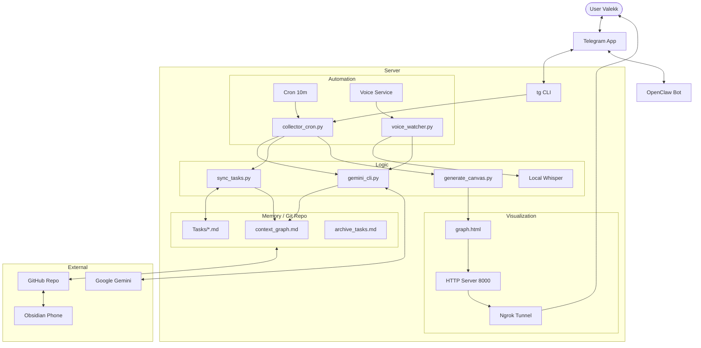

# JARVIS System Architecture

## Overview
Current state of the server (v4.0).
Optimized for **Low Token Cost**, **Zero DB**, **Obsidian Sync**.

## File Inventory

### Core Scripts
- **collector_cron.py**: Main engine. Reads chat, extracts entities, updates graph, syncs tasks, pushes git.
- **voice_watcher.py**: Audio handler. Watches `inbound/`, runs Whisper, extracts tasks, appends to graph.
- **gemini_cli.py**: AI Wrapper. Handles API keys (`keys.json`), retries, text/audio requests.
- **key_manager.py**: Key rotation logic.
- **generate_canvas.py**: Visualizer. Reads Markdown -> Generates D3.js HTML.
- **sync_tasks.py**: Task Sync. Reads `[x]` from Obsidian, updates Graph, regenerates lists.

### Data (Memory)
- **context_graph.md**: The Database (Raw).
- **Tasks/**: User interface (Day/Month/Global).
- **.archive/**: History.

### Services
- **openclaw**: Gateway daemon.
- **jarvis-voice**: Systemd unit for voice watcher.
- **http.server**: Python static server (port 8000).
- **ngrok**: Tunnel (port 8000).

## Cleanup Targets (Unused)
- `setup_strict_jarvis.py` (Installer).
- `reorganize_tasks.py` (One-off).
- `cleanup_tasks.py` (Old).
- `deep_cleanup.py` (Old).
- `backfill.py` (Old).
- `fix_graph.py`, `refine_graph.py` (Maintenance tools - Keep?).
- `generate_legacy.py`, `generate_user_view.py`.
- `_archive/`: Huge folder of legacy PostgreSQL/JSON systems.

## Optimization Plan
1. Delete One-off scripts.
2. Compress/Delete `_archive`.
3. Clear logs.
